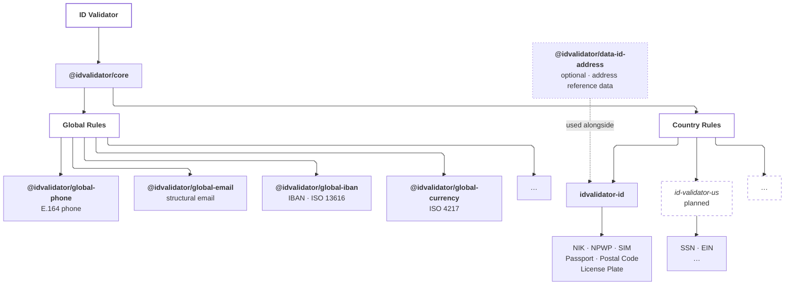

<h1 align="center">ID Validator</h1>

<p align="center">
  <em>Type-safe validation, normalization, parsing, and formatting for country-specific and global structured data</em>
</p>

<p align="center">
  <a href="https://github.com/BaimPriyatna/id-validator/actions/workflows/ci.yml"></a>
  <a href="LICENSE"></a>
  <a href="package.json"></a>
  <a href="CHANGELOG.md"></a>
  
  
</p>

<p align="center">
  One API style. Many countries. Local validation. No network.<br>
  <strong><a href="https://baimpriyatna.github.io/id-validator/">Try it in the browser →</a></strong> — no install required.
</p>

---

## Highlights

- **One consistent API** — every validator exposes the same
  `validate` / `normalize` / `parse` / `format` shape (where it makes sense),
  and every failure carries a stable error `code`.
- **Country-aware naming** — `nik`, `npwp`, `sim`, not a vague `nationalId`.
- **Runs locally** — no network calls, no API keys, no telemetry. Safe for
  forms, backends, edge functions, and the browser.
- **Fast** — ~1M NIK validations/sec on a laptop ([benchmarks](./BENCHMARKS.md)).
- **Typed end to end** — dual ESM/CJS builds with full `.d.ts` / `.d.cts`.
- **Modular** — country packages never depend on each other, and address
  reference data lives in its own optional package.

---

## Quick start

```bash
npm install idvalidator-id
```

```ts
import { nik, phone, postalCode, licensePlate } from "idvalidator-id";

nik.validate("3171051708900001");
// { valid: true, errors: [], value: "3171051708900001" }

nik.parse("3171051708900001");
// { provinceCode: "31", regencyCode: "71", districtCode: "05",
//   birthDate: "1990-08-17", gender: "male", sequence: "0001" }

phone.validate("+6281234567890");   // { valid: true, ... }
postalCode.validate("40115");       // { valid: true, ... }
licensePlate.validate("B 1234 XYZ"); // { valid: true, ... }
```

Results are plain objects, so branching is straightforward:

```ts
const result = nik.validate(input);
if (!result.valid) {
  for (const error of result.errors) console.log(error.code, error.message);
}
```

Error codes are documented in [ERROR-CODES.md](./ERROR-CODES.md).

### Turning codes into names (optional)

Want real region names instead of numeric codes? Add the optional address data
package:

```bash
npm install @idvalidator/data-id-address
```

```ts
import { nik } from "idvalidator-id";
import { resolveAddress, resolvePostalCode } from "@idvalidator/data-id-address";

resolveAddress(nik.parse("3171051708900001"));
// { province: { code: "31", name: "Daerah Khusus Ibukota Jakarta" },
//   regency:  { code: "71", name: "Kota Administrasi Jakarta Pusat" },
//   district: { code: "05", name: "Cempaka Putih" } }

resolvePostalCode("40115"); // province / regency / district names for the code
```

---

## Important

> [!IMPORTANT]
> A successful validation means the input matches the known structural
> rules this library implements. It does **not** confirm that the
> underlying identifier exists, is currently active, or is officially
> registered with any government or authority (Dukcapil, DJP, DMV, etc.).
> Official verification is out of scope by design — see
> [ARCHITECTURE.md](./ARCHITECTURE.md) ("Validation vs Verification").

---

## Table of Contents

- [Highlights](#highlights)
- [Quick start](#quick-start)
- [Important](#important)
- [Architecture](#architecture)
- [Packages](#packages)
- [Status (v1)](#status-v1)
- [Address data](#address-data)
- [Framework examples](#framework-examples)
- [Performance](#performance)
- [Requirements](#requirements)
- [Development](#development)
- [Project Structure](#project-structure)
- [Known Limitations](#known-limitations)
- [Compatibility](#compatibility)
- [Roadmap](#roadmap)
- [Contributing](#contributing)
- [License and data attribution](#license-and-data-attribution)

---

## Architecture



- **Country-aware** — each country package (`id-validator-<cc>`) uses the
  terminology and rules developers actually encounter there (`nik`,
  `npwp`, not a generic `nationalId`).
- **Shared global rules** — data that isn't tied to one country (phone,
  email) is implemented once in `packages/global/*` and reused across
  country packages.
- **Independent packages** — installing `idvalidator-id` doesn't pull in
  unrelated countries, and country packages never depend on each other.

Full design rationale, the validation pipeline, and the error model are in
[ARCHITECTURE.md](./ARCHITECTURE.md). Per-validator behavior,
what each one does and does **not** check, is in
[REFERENCE.md](./REFERENCE.md).

---

## Packages

| Package | Scope |
| --- | --- |
| `@idvalidator/core` | Shared types, result/error model, normalization primitives |
| `idvalidator-id` | Indonesia: NIK, NPWP, SIM, Passport, Postal Code, License Plate, Phone, Email |
| `@idvalidator/global-phone` | E.164 phone validation, reused by every country package |
| `@idvalidator/global-email` | Structural email validation, reused by every country package |
| `@idvalidator/global-iban` | IBAN structural validation (ISO 13616) with the ISO 7064 mod-97-10 checksum and SWIFT per-country lengths |
| `@idvalidator/global-currency` | ISO 4217 currency codes, minor-unit precision, and major/minor unit conversion (no exchange rates) |
| `@idvalidator/data-id-address` *(optional)* | Indonesia address reference data: province / regency / district, postal-code lookups in both directions, village (desa/kelurahan) data, and plate-region codes — see [Address data](#address-data) |

---

## Status (v1)

| Domain | Status |
| --- | --- |
| `nik`, `npwp`, `phone`, `licensePlate` | fully implemented — validate/normalize/parse/format. `nik` checks province/regency codes against real Kemendagri data. |
| `postalCode` | validate/normalize only — see `@idvalidator/data-id-address` (optional) for province/regency/district lookup |
| `sim`, `passport` | heuristic validate-only (no consolidated public spec) |
| `email` (global) | fully implemented — validate/normalize/parse |

---

## Address data

`@idvalidator/data-id-address` is deliberately a separate, optional package:
the reference datasets are large, and most validation use cases don't need
them. Full API details live in the
[package README](./packages/data-id-address/README.md); the overview:

| Need | Function |
| --- | --- |
| NIK codes → names | `resolveAddress(nik.parse(...))` |
| Postal code → region(s) | `lookupPostalCode`, `resolvePostalCode` |
| Region name → postal code(s) | `searchPostalCodesByName(query, { level, output })` |
| Plate region code ↔ area | `lookupPlateRegion`, `searchPlateCodesByArea` |
| Villages of a district (for cascading dropdowns) | `listVillagesInDistrict(provinceCode, regencyCode, districtCode)` |
| Region name → postal code(s), down to village rows | `searchVillagesByName(query, { level, output, fields })` |
| Postal code → region(s) and villages | `resolvePostalCodeVillages(code, { granularity, fields })` |

### Village-level (desa/kelurahan) data

Village functions are **async** and load a separate dataset (~2.5 MB raw,
~0.65 MB gzipped) **lazily, only when a call actually asks for village data**.
Everything else in the package stays synchronous and never triggers that load.

```ts
import {
  listVillagesInDistrict,
  searchVillagesByName,
  resolvePostalCodeVillages,
} from "@idvalidator/data-id-address";

// Every village in Kecamatan Batujaya, Karawang (exact key lookup, no name matching)
await listVillagesInDistrict("32", "15", "08");
// [{ provinceCode: "32", regencyCode: "15", districtCode: "08", code: "2001", name: "Batujaya" },
//  { ..., code: "2002", name: "Telukambulu" }, ...]

// Name → postal code. Rows default to the level you searched at.
await searchVillagesByName("batujaya", { level: "district", output: "rows" });
// [{ postalCode: "41354", district: { code: "08", name: "Batujaya", ... } }]

// Choose which levels are attached. `fields` accepts an array or a colon string,
// mixing full names and single-letter shorthands ("province:d" and "p:d" both work).
await searchVillagesByName("batujaya", { level: "district", output: "rows", fields: "p:d" });
// [{ postalCode: "41354", province: { name: "Jawa Barat" }, district: { name: "Batujaya" } }]

// Postal code → every village that carries it
await resolvePostalCodeVillages("41354", { granularity: "village", fields: "d:v" });
```

A few rules worth knowing:

- `postalCode` is always present on every row; `fields` only controls which
  region levels are attached next to it.
- `fields` must be in hierarchical order (`province` → `regency` → `district`
  → `village`), but any subset is allowed. `"district:village"` is valid,
  `"village:district"` is rejected, and so is `"prov"` (only full names or
  `p` / `r` / `d` / `v`).
- `level` is required for name searches and accepts `province`, `regency`, or
  `district`. There is deliberately no free-text village-name search: if you
  already know the district, use `listVillagesInDistrict`.
- `output: "codes"` returns a deduplicated `string[]`. If `query` matches
  several regions (for example, a kecamatan named "Bandung" exists in more than
  one regency), those codes are merged with no way to tell which belongs to
  which — use `output: "rows"` when you need attribution.

> [!NOTE]
> Village data adds **completeness** (the desa name next to the code, the way
> postal-code sites show it), not disambiguation. About 7.5% of postal codes
> genuinely span more than one kecamatan, and that figure is identical at
> district and village granularity. Only ~17.5% of kecamatan have villages
> with different postal codes; in the rest, every village shares one code.
> NIKs encode down to kecamatan only, so village data cannot be derived from a
> NIK.

---

## Framework examples

Copy-paste integrations for Express (middleware), Zod (`.refine()` /
`.superRefine()`), and React (form validation):

→ **[EXAMPLES.md](./EXAMPLES.md)**

---

## Performance

On a typical developer laptop (Node 22, Windows x64), validating **100,000**
structurally valid NIKs takes on the order of **~100 ms** (~1M ops/sec).
Full table, methodology, and how to re-run / compare baselines:

→ **[BENCHMARKS.md](./BENCHMARKS.md)**

```bash
npm run build && npm run bench:throughput   # 100k wall-clock table
npm run bench                               # Vitest + Tinybench
```

---

## Requirements

- Node.js 18 or newer
- npm (workspaces-based monorepo)

---

## Development

```bash
npm install
npm run build      # builds all packages (dual ESM/CJS + .d.ts via tsup)
npm run typecheck  # tsc -b --noEmit
npm run lint       # eslint
npm test           # vitest, all packages
npm run size       # check bundle sizes against configured limits
npm run bench      # performance (see BENCHMARKS.md)
```

> [!TIP]
> Run `npm run build` **before** `npm run typecheck` on a fresh clone. Packages
> import each other through their built `dist/` output, so typechecking (or
> opening the repo in an editor) before the first build reports
> `Cannot find module '@idvalidator/core'` errors that disappear once the
> packages are built.

Other scripts:

```bash
npm run build:playground   # browser playground (deployed to GitHub Pages on push to main)
npm run build:data:village # regenerate the village dataset from upstream (manual, see below)
```

`build:data:village` is intentionally **not** part of `npm run build`: it is
reference data, not a derivative of source code. It pins both upstream
repositories to specific commits and cross-validates district codes against
`admin-hierarchy.json`, so a re-run is reproducible and fails loudly if
upstream has drifted.

**Bundle size enforcement:** All packages have configured size budgets
(`.size-limit.js`) checked automatically in CI. Run `npm run size` locally
before submitting PRs that add features or data. See
[`CONTRIBUTING.md`](CONTRIBUTING.md) § "Bundle Size Budgets" for limits and
how to handle legitimate increases.

**Data update schedule:** Reference data (Kepmendagri regions, ISO codes,
etc.) is checked quarterly via automated reminders. See
[`.github/workflows/data-update-reminder.yml`](.github/workflows/data-update-reminder.yml).

See [`CONTRIBUTING.md`](CONTRIBUTING.md) for adding a validator, opening
issues/PRs, and cutting a release. Community norms are in
[`CODE_OF_CONDUCT.md`](CODE_OF_CONDUCT.md).

---

## Project Structure

```
id-validator/
├── README.md
├── EXAMPLES.md           # Express / Zod / React integration snippets
├── BENCHMARKS.md         # Throughput numbers + how to re-run / compare
├── CHANGELOG.md
├── CONTRIBUTING.md
├── CODE_OF_CONDUCT.md
├── ARCHITECTURE.md
├── ERROR-CODES.md
├── REFERENCE.md
├── SECURITY.md
├── LICENSE
├── benchmarks/           # Vitest bench baseline JSON for --compare
├── playground/           # Browser playground (built to GitHub Pages)
├── scripts/
│   ├── throughput.mjs            # 100k wall-clock benchmark
│   └── build-village-data.mjs    # village dataset builder (pinned upstream commits)
├── .github/
│   ├── ISSUE_TEMPLATE/   # bug + feature issue forms
│   ├── PULL_REQUEST_TEMPLATE.md
│   └── workflows/        # ci.yml (test), playground.yml (Pages), release.yml (publish)
└── packages/
    ├── core/                     # @idvalidator/core
    ├── global/
    │   ├── phone/                # @idvalidator/global-phone
    │   ├── email/                # @idvalidator/global-email
    │   ├── iban/                 # @idvalidator/global-iban
    │   └── currency/             # @idvalidator/global-currency
    ├── id/                       # idvalidator-id
    └── data-id-address/          # @idvalidator/data-id-address (optional)
        ├── data/                 # admin hierarchy, postal index, plate codes, village index
        └── src/                  # index.ts (sync API), village.ts (async, lazy-loaded)
```

---

## Known Limitations

- `postalCode`, `sim`, and `passport` don't have `.parse()`/`.format()` in
  the core package — see the [Status](#status-v1) table and
  [REFERENCE.md](./REFERENCE.md) for why (bundle-size budget, or no official spec to
  validate against).
- `@idvalidator/data-id-address`'s province/regency/district/postal/village
  data is sourced from MIT-licensed community datasets aligned with Kemendagri
  codes (see [attribution](#license-and-data-attribution)). Its vehicle plate
  region-code lookup (`lookupPlateRegion`) is **community-sourced, not
  official**, since no machine-readable Korlantas/Polri dataset is known to
  exist.
- Postal-code reverse lookups can return more than one district (~7.5% of
  codes). All matches are returned rather than guessing one.
- **`sim` and `passport` cannot detect an invalid number.** Both are
  heuristic shape checks with no reference data, so `sim.validate("000000000000")`
  and `passport.validate("Z0000000")` return `valid: true`. Use the
  `confidence` field to detect this programmatically — it reports `"heuristic"`
  for both, versus `"cryptographic"` for `iban` or the legacy 15-digit `npwp`.
- **Tree-shaking works at the package level only, not per-validator.**
  `idvalidator-id` bundles all of its validators into a single
  `dist/index.js`. Importing just one validator (e.g. `import { postalCode }
  from "idvalidator-id"`) does not let a bundler (esbuild, webpack, etc.)
  exclude another validator's code or data from the final bundle —
  verified empirically: a bundle built from `postalCode` alone still
  included `nik`'s ~30 KB province/regency dataset. Planned fix:
  per-validator subpath exports (e.g. `idvalidator-id/nik`). Until then,
  expect the full `idvalidator-id` bundle size (~62 KB minified) regardless
  of which validators you actually use.
- Only Indonesia (`idvalidator-id`) is implemented so far.

---

## Compatibility

| Environment | Status |
| --- | --- |
| Node.js 18 / 20 / 22 | Tested — CI runs the full test suite on all three every push ([`ci.yml`](.github/workflows/ci.yml)) |
| TypeScript | Tested — `tsc --noEmit` per package in CI; full `.d.ts`/`.d.cts` shipped |
| ESM | Tested — package `type: module`, ESM build exercised by the test suite and manual smoke tests |
| CommonJS | Tested — dual `.cjs` build, manually verified with `require()` |
| Browser | Tested via [jsdom](https://github.com/jsdom/jsdom) (a simulated DOM environment, not a full browser engine) — all validators load and run correctly with no Node-only APIs used (confirmed by both static analysis and the jsdom run). **Not tested in a real browser** (Chrome/Firefox/Safari) — if you hit an issue there, please open an issue. |
| Bun | **Untested.** No network access to install Bun in this project's CI/dev sandbox at time of writing. Code uses no Bun-specific or Node-only APIs, so it's likely to work, but this is not verified. |
| Deno | **Untested**, same reason as Bun. |

---

## Roadmap

See [`CHANGELOG.md`](CHANGELOG.md) for full version history. Not yet
started, per the original PRD: additional country packages
(`id-validator-us`, `-my`, `-sg`, ...), further global modules (SWIFT/BIC),
and per-validator subpath exports for real tree-shaking (see
Known Limitations above).

Implemented since that list was written: `@idvalidator/global-iban`
(IBAN structural validation) and `@idvalidator/global-currency` (ISO 4217
codes and minor-unit conversion).

---

## Contributing

Bug reports, new validators, and data corrections are welcome. Start with
[`CONTRIBUTING.md`](CONTRIBUTING.md), and please report security issues via
[`SECURITY.md`](SECURITY.md) rather than a public issue.

---

## License and data attribution

Apache License 2.0 — see [LICENSE](LICENSE).

The village-level dataset is derived from two MIT-licensed upstream projects
by [cahyadsn](https://github.com/cahyadsn):
[`wilayah`](https://github.com/cahyadsn/wilayah) (region codes and names) and
[`wilayah_kodepos`](https://github.com/cahyadsn/wilayah_kodepos) (village →
postal code). Thank you to the maintainers.
